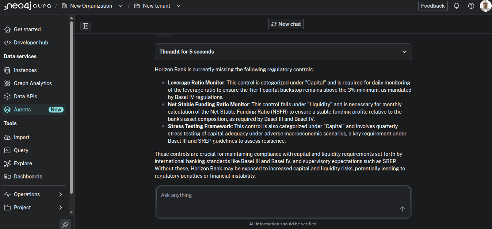
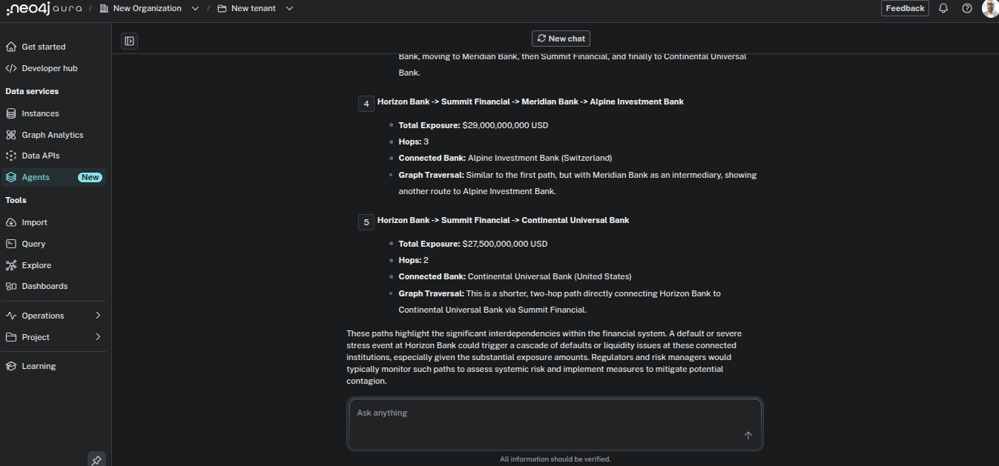
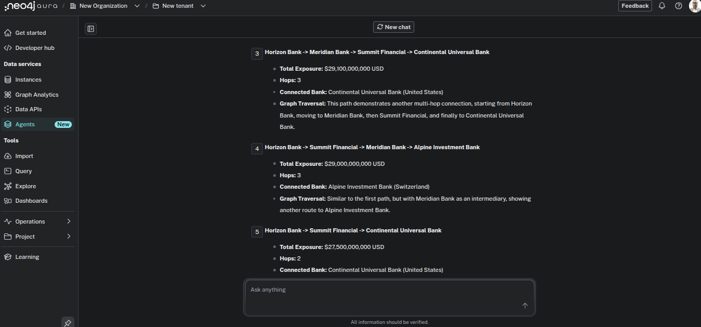
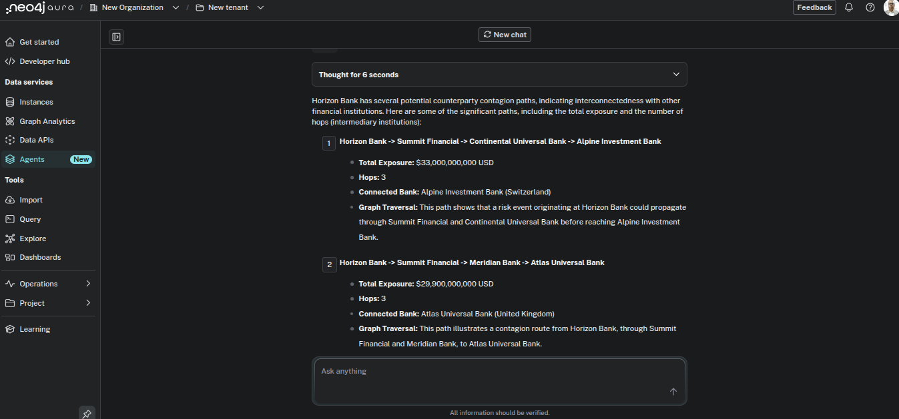
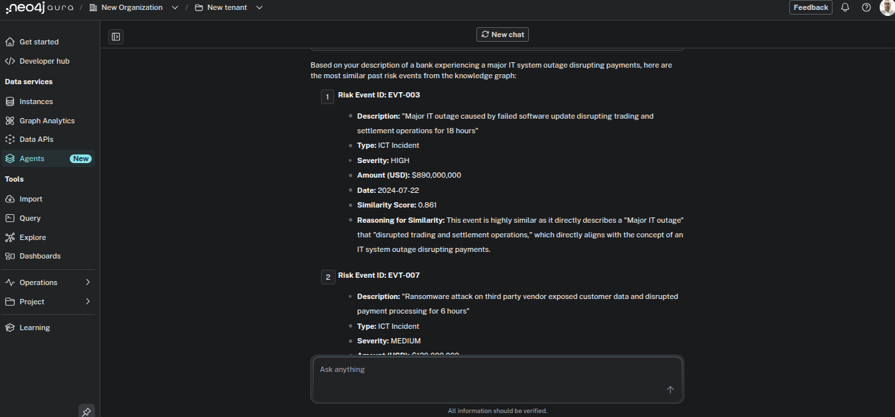
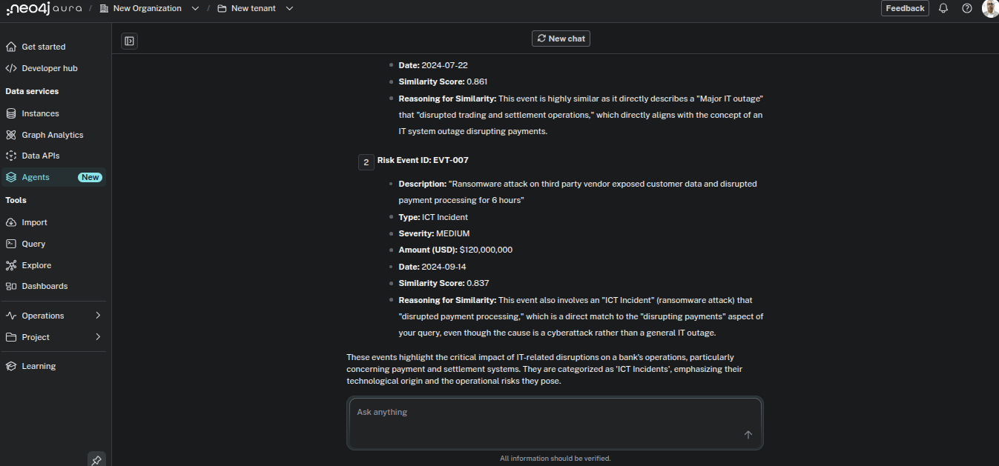
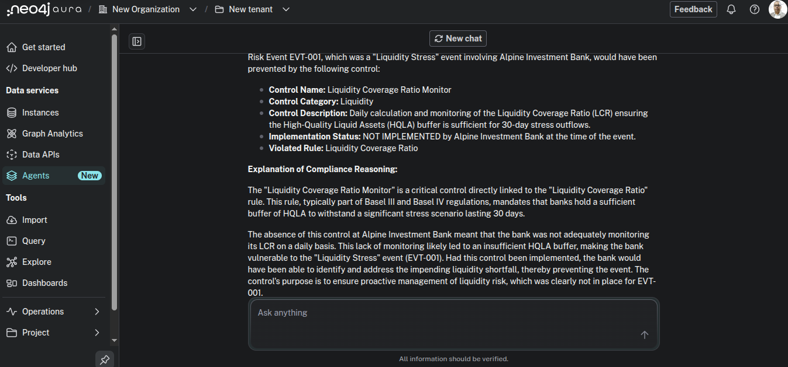

# RegulatoryRisk-GraphAgent - 2nd place winner for Neo4J Aura Hackathon 

## Title: RegulatoryRisk GraphAgent — Financial Compliance Navigator

## Agent Name

RegulatoryRisk GraphAgent — Financial Compliance Navigator

## What it does

RegulatoryRisk GraphAgent helps compliance officers answer questions no flat database can:

* "Which Basel IV controls is this bank missing and why?"

* "What is the full counterparty contagion chain if this bank fails?"

* "Which regulatory rule was violated in this risk event?"

* "Find past incidents semantically similar to this new breach"

* "What controls would have prevented this risk event?"

* "Which Basel IV rules supersede older Basel III rules?"

The agent traverses a knowledge graph of financial institutions, regulatory obligations, control implementations, counterparty exposures, and historical risk events to explain WHY something is compliant or risky — not just whether it is. Every answer cites the exact graph relationship path that produced it.

What makes this unique: the agent is also published as a live MCP server endpoint and connected directly to Claude.ai via MCP connector — judges can query it live from Claude right now.

## Dataset and why a graph fits

The graph models the global banking regulatory landscape with fictional institution names:

| Node Type | Count | Description |
|-----------|-------|-------------|
| Entity | 8 | Banks across US, UK, Germany, Switzerland, India |
| Regulation | 5 | Basel IV, Basel III, DORA, Dodd-Frank, SREP |
| Rule | 10 | Regulatory rules with supersession chains |
| Control | 10 | Compliance controls linked to specific rules |
| RiskEvent | 7 | Historical incidents with severity and financial impact |
| Regulator | 6 | Enforcement bodies with jurisdiction |
| **Total** | **46 nodes** | **96 relationships, 10 relationship types** |

## Why only a graph solves this:

A compliance officer asking "Is Horizon Bank compliant with Basel IV?" needs to traverse:

`(Entity)-[:SUBJECT_TO]->(Regulation)-[:CONTAINS]->(Rule)
  -[:REQUIRES_CONTROL]->(Control)`

Then check:

`(Entity)-[:IMPLEMENTS]->(Control)`

That is a 4-hop traversal. The missing controls are the difference between those two sets. No SQL query or flat table can express this cleanly — and it gets worse when you add counterparty contagion:

`(Bank)-[:COUNTERPARTY_OF*1..3]->(Bank)-[:INVOLVED_IN]
  ->(RiskEvent)-[:TRIGGERED_BY]->(Rule)`

This is a multi-hop path traversal with relationship property aggregation — total USD exposure accumulated across each hop. The graph makes the reasoning transparent and auditable, which is exactly what regulators demand.

## Additional graph-native features:

* SUPERSEDES chain — Basel IV rules supersede Basel III rules, enabling regulatory evolution tracking

* TRIGGERED_BY — links risk events directly to the rule that was breached

* AFFECTED — tracks which entities were impacted by contagion from a risk event

* Vector embeddings (3072-dim Gemini) on RiskEvent nodes for semantic similarity search

## Agent Tools

| Tool | Type | What it does |
|------|------|------------|
| Missing Regulatory Controls for Bank | Cypher Template | 4-hop traversal finding controls required by regulation but not implemented by the bank |
| Counterparty Contagion Paths | Cypher Template | Multi-hop COUNTERPARTY_OF traversal up to 3 hops with cumulative USD exposure |
| Rules Violated by Risk Event | Cypher Template | Links RiskEvent → Rule → Regulation → Entity for full violation context |
| Bank Regulations and Enforcement | Cypher Template | Entity → Regulation → Regulator with jurisdiction and authority level |
| Superseding Basel Rules | Cypher Template | SUPERSEDES chain showing Basel IV replacing Basel III rules |
| Preventive Controls for Risk Event | Cypher Template | RiskEvent → Rule → Control with implementation status and prevention assessment |
| Search Similar Risk Events | Similarity Search | 3072-dim Gemini embeddings on risk event descriptions via vector cosine index |
| Natural Language to Cypher | Text2Cypher | Last resort fallback for ad-hoc aggregation queries |

## Example interactions

1. Compliance gap analysis (Cypher Template)

Query: "What regulatory controls is Horizon Bank missing?"

Response: Identifies 3 missing controls — Leverage Ratio Monitor (Basel IV, daily), Stress Testing Framework (Basel III + SREP, quarterly), NSFR Monitor (Basel III + Basel IV, monthly) — with regulation, frequency, purpose and risk exposure summary.

2. Counterparty contagion (Cypher Template)

Query: "Show me counterparty contagion paths from Horizon Bank"

Response: Returns 10 multi-hop paths with full chain traversal, cumulative USD exposure per path, hop count, and circular risk loops where contagion returns to the originating bank — total systemic exposure quantified.

3. Semantic incident matching (Similarity Search)

Query: "Find past risk events similar to a ransomware attack on banking infrastructure"

Response: Matches EVT-007 (score 0.837, ransomware on third-party vendor) and EVT-003 (score 0.861, IT outage disrupting operations) with semantic reasoning explaining why each event matches.

4. Preventive control analysis (Cypher Template)

Query: "What controls would have prevented risk event EVT-001?"

Response: Traces EVT-001 → TRIGGERED_BY → BASEL4-LIQ-1 → REQUIRES_CONTROL → Liquidity Coverage Ratio Monitor, confirms control was NOT IMPLEMENTED at Alpine Investment Bank, explains the causal chain.

What makes this different from other submissions

1. Graph drives every single answer. No response is a simple lookup. Every answer traces a multi-hop relationship path and explains the compliance reasoning. The agent never returns a fact without the graph path that produced it.

2. Live MCP integration with Claude.ai. The agent is published as an MCP server and connected directly to Claude.ai. This is not just a demo inside Aura console — it works as a real tool inside Claude conversations right now.

3. Real-world enterprise domain. Financial regulatory compliance is a $50B/year industry problem. This agent addresses the exact compliance gap analysis and systemic risk assessment work that banks do manually today.

4. All 3 tool types used strategically. Cypher Templates for precise multi-hop traversals (6 templates), Similarity Search for semantic incident matching with 3072-dim Gemini embeddings, Text2Cypher as true last-resort fallback — exactly per Neo4j best practice.

5. Regulatory evolution tracking. The SUPERSEDES relationship between Basel IV and Basel III rules is unique to this submission — it models how regulations evolve over time, enabling queries like "which of our controls were designed for Basel III rules that Basel IV has now superseded?"

6. Explainability built in. Every answer states which rule requires which control, which regulator enforces which regulation, and which relationship path produced the answer — making the reasoning auditable and transparent.

## Screenshots

### Graph visualization in Aura Explore tool

### Agent answering missing controls query in Aura console

### Counterparty contagion paths response

### Similarity search response

### Preventive controls response

### Claude.ai using RegulatoryRisk GraphAgent via MCP

### Counterparty contagion via Claude MCP

### Similarity search via Claude MCP

### Agent link

* MCP Server: https://mcp.neo4j.io/agent?project_id=eea6f4d8-312a-460d-92f3-39cd02dd6f00&agent_id=094a1896-0acc-46d2-847b-5d120db58e59

### To connect: Claude.ai → Settings → Connectors → Add custom connector → paste MCP URL

## Built by

### Dhiraj Patra

AI, Agentic Workflows Lead & Architect  | 10+ Years Driving Enterprise AI InnovationSenior Engineering Lead | AI/ML Architect | Technical Architect EY — embedded within BNY Mellon Enterprise Risk Technology

28+ years experience | Patent holder in EDGE AI

LinkedIn: linkedin.com/in/dhirajpatra 

Twitter/X: x.com/dhirajpatra

